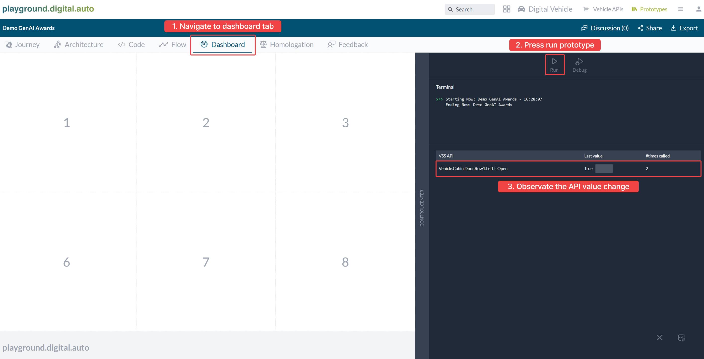

# Challenge: SDV Coding Companion

Welcome to the SDV Coding Companion Hackathon challenge! This guide will walk you through accessing your free AWS credits, setting up your project, and building a GenAI model on AWS Bedrock. Follow each step to make the most of your AWS Bedrock credits and successfully develop your project.

---

## How to Access Your Free AWS Credits

1. **Access the Registration Page**
   - Visit [genai.digital.auto](http://genai.digital.auto/).
   - Register a new account and log in. Logging in with a GitHub account is also available.
     
2. **Complete Your Team Information**
   - Enter your team details. Ensure all team members (up to 5) have registered accounts.
     
3. **Apply for AWS Bedrock Credits**
   - Provide a clear description of your project idea to apply for AWS credits.
     
   - Submit your application and wait for approval, which may take some time.
   - 

4. **Review Your Team’s AWS Credentials**
   - Once approved, your IAM user credentials and password will be available.
     
   - **Note:** Access keys provided here cannot be used for direct AWS API calls due to security restrictions. They are exclusively for submitting your GenAI.

---

## How to Access the AWS Bedrock Console

1. **Log in to AWS**
   - Copy your IAM user credentials and password, then click "Open AWS Bedrock."
   - Enter your IAM username and password, then sign in.
     
     

2. **Navigate to the AWS Bedrock Console**
   - Use the search bar to find "AWS Bedrock," then access the Bedrock Console.
      
3. **Set Your Region**
   - Change the AWS region to **US East (N. Virginia) - us-east-1** to ensure access to all available LLM models.
      

---

## Building Your GenAI Model on Bedrock

1. **Access the Playground**
   - In the AWS Bedrock Console, navigate to the **Playground/Chat** section to begin experimenting.
     
2. **Choose Your Model**
   - Select a provider and model, then click “apply” to return to the Playground chat interface.
     
      
3. **Experiment with a Simple Prompt**
   - Try entering a prompt such as: “Generate an SDV Python code to open the driver’s door.”
     
     
   - Note that the initial output may include extra comments—adjustments are often needed to refine the response.

4. **Refining Model Responses with System Messages**
   - Use “system messages” to provide context and instructions for the model, improving accuracy and relevance. Below are example system messages to use as templates (do not copy them directly):
     - [GenAI Python Template](https://bewebstudio.digitalauto.tech/data/projects/alSxlS1Qkf20/GenAI_Python.md)
     - [GenAI Dashboard Template](https://bewebstudio.digitalauto.tech/data/projects/alSxlS1Qkf20/GenAI_Dashboard.md)
     - [GenAI Widget Template](https://bewebstudio.digitalauto.tech/data/projects/alSxlS1Qkf20/GenAI_Widget.md)
      
   - **Tip:** Use these templates as a base. Under “Instruction,” enter general guidelines, and under “Requirement,” place specific requests for your project’s needs. Once you identify an effective instruction or system message, save it and consider submitting it to [marketplace.digitalauto.tech](https://marketplace.digitalauto.tech) for public use.
5. **Testing the Refined Code**
   - After adding instructions, the output should contain only the code, optimized for the Playground environment.
     
   - Paste the code into the **Code** tab, run the prototype, and observe any API value changes.
     
     
6. **Enhance with Widgets**
   - To visualize API values more effectively, add widgets to your prototype. If you are new to the Playground, start by building a basic prototype for hands-on practice.

---

## How to Submit Your GenAI Model

1. **Access the Marketplace**
   - From the previous **Review Your Team** screen, click "Go to marketplace," or directly visit [https://marketplace.digital.auto](https://marketplace.digital.auto).

2. **Log In**
   - If you’ve previously logged into the GenAI website, your login should carry over. If you are not logged in, please use the same account you registered with.

3. **Add a New Package**
   - Click **Add Package** to create a new submission.
     
      
1. **Fill in the Package Information**
   - **Basic Information:** Include a package name, short description, and detailed description. Set visibility to **Public**.
   -   
   - **Category:** Select **GenAI** and choose the corresponding type of GenAI model.
   - **Credentials and Config:** Copy these from the **Review Your Team** screen from the previous step. For endpoint URL, follow the syntax provided below.

     **Endpoint URL Syntax:**
     ```
     https://bedrock-runtime.us-east-1.amazonaws.com/model/<model_id>/invoke-with-response-stream
     ```
     For model-specific details, refer to [AWS documentation](https://docs.aws.amazon.com/bedrock/latest/userguide/model-ids.html#model-ids-arns).  
     Example: If you’re using the Claude 3 Sonnet model:
     ```
     https://bedrock-runtime.us-east-1.amazonaws.com/model/anthropic.claude-3-sonnet-20240229-v1:0/invoke-with-response-stream
     ```
     
   - **Add Images:** Upload a **Package Icon**, **Package Cover**, and **Feature Images** (at least one required for feature images).

2. **Submit Your GenAI**
   - Once you’ve filled in all the information, click **Submit** to submit your GenAI.

3. **View Your Submissions**
   - To view all your submissions, click on the **My Package** tab in the website header.

**Note:** To submit another GenAI model, start over from step 1.

---

## How to Update Your GenAI Model

1. **Access the Marketplace**
   - Navigate to **My Package** on marketplace.digital.auto after logging in.
     
2. **Select Your GenAI Package**
   - Find and select the GenAI package you wish to update.

3. **Update the Package**
   - Click the **Update** button to modify your submission.
     
      
4. **Adjust the Deployment URL, Credentials, and Instructions**
   - Make necessary changes to your endpoint URL, credentials, and system instructions, then save the updated package.

     
---

## How to Use GenAI on the Playground

### 1. **SDV ProtoPilot (GenAI Python)**

- Click on the **SDV ProtoPilot** button.

  
- Enter your input prompt and select a generator.

  
- Choose a generator from the marketplace. Your own generator will appear once approved by the admin.
- Click **Generate** and wait 30-90 seconds for the code to be generated. The time may vary depending on model training.

  
- If you are satisfied with the generated code, click **Add new generated code**.
  
  
  

### 2. **Dashboard ProtoPilot (GenAI Dashboard)**

- Go to the **Dashboard Config** tab and click the **Dashboard ProtoPilot** button.
    
- Select a generator from the marketplace. Your own generator will appear once approved by the admin.
    
- Enter your input prompt and click **Generate**. Wait for the dashboard to be generated.
    
- Once generated, you’ll see the dashboard configuration. Click **View Dashboard** to view the raw configuration.
  
- If satisfied, click **Add new dashboard config** to add it.

  

### 3. **Widget ProtoPilot (GenAI Widget)**

- Go to the **Dashboard Config** tab and add a widget by clicking the **Widget ProtoPilot** button.
  
- Select a generator from the marketplace. Your own generator will be displayed once approved.
    
- Enter your prompt and click **Generate**. Wait for the widget to be generated.
   
- After it’s generated, you can preview it embedded in an iframe. If it meets your expectations, click **Add Widget** to add it to your selected dashboard box.

  
- To view or modify the widget code, hover over the widget box and click the icon linking to **Widget Studio**. You can edit the HTML, CSS, and JavaScript of the widget.

  
  

### 4. **How Playground Handles GenAI Responses**

When interacting with GenAI models via the Playground, responses are structured for effective processing and presentation across different platforms, including Amazon Bedrock.

- **HTTP POST Method:** Requests to your model’s endpoint will include user input (and optionally system messages) for secure and structured communication.
- **AWS Bedrock Models:** Requests sent to Bedrock will return responses in a specific JSON format. This ensures smooth integration with the Playground system.

---

Good luck with your Hackathon project! Experiment, iterate, and take full advantage of the tools and templates available.
